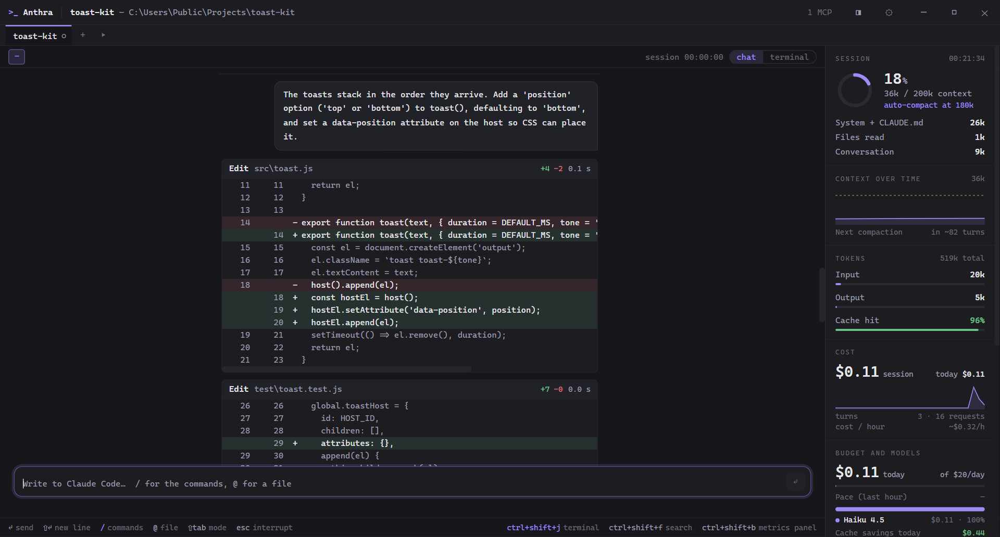

<div align="center">

# `>_` Anthra

**The terminal that opens already inside Claude Code.**

Open a directory and Claude Code is running. Beside it, a panel shows how much context
you are burning, what the session costs, your plan limits and which tab needs you.



</div>

This repository hosts Anthra's **releases**, its Scoop bucket and its website. Report bugs
and ideas in [Issues](https://github.com/iFrosty-tech/anthra/issues).

## Features

- **Live panel** for context, token breakdown, cost and plan limits (Pro and Max), resizable
  and rearrangeable — sections reorder, show or hide from Preferences → Panel (or drag by
  title / Alt+↑/↓); a click on a section title folds it.
- **Tasks**: `Ctrl+Shift+N` opens a tab on a new git worktree and branch, so two Claude Code
  sessions can work on the same repository without conflicts. Closing a task merges it, opens
  a pull request through the GitHub CLI, or discards it.
- **Git status** on every tab — the branch of a task, commits ahead/behind, and a mark while
  something is uncommitted — and a diff of every file touched since the tab started.
- **Timeline** (`Ctrl+Shift+H`) of a session, turn by turn, with Resume for closed chats.
- **Search** (`Ctrl+Shift+F`) across every chat, with phrases, exclusions and filters.
- **Cost analysis** (`Ctrl+Shift+K`) by project, model or week, exportable to CSV or JSON.
- **Split pane** (`Ctrl+Shift+D`): two tabs side by side, restored on next launch.

## Install

| How | Command or link | Updates |
| --- | --- | --- |
| **Installer** | [`Anthra-Setup-<version>-x64.exe`](https://github.com/iFrosty-tech/anthra/releases/latest) | By itself |
| **winget** | `winget install iFrosty-tech.Anthra` | By itself, or `winget upgrade` |
| **Scoop** | `scoop bucket add anthra https://github.com/iFrosty-tech/anthra`<br>`scoop install anthra` | `scoop update anthra` |
| **Portable** | [`Anthra-Portable-<version>-x64.exe`](https://github.com/iFrosty-tech/anthra/releases/latest) | Download the new one |

winget and Scoop are available from version 0.7.0, the first release published here.

Requirements: Windows 10 or 11, and [Claude Code](https://claude.com/claude-code) on your
`PATH`. The installer is per-user and needs no admin rights. Tasks need git on your
`PATH`; opening a pull request from a task needs the [GitHub CLI](https://cli.github.com),
logged in.

## Updates

The installed build checks for a new version 30 seconds after launch and every 6 hours,
downloads it in the background and installs it **when you quit** — or right away with
**Restart to update** in the tab bar. Your windows, tabs and chats are reopened
afterwards, and a *What's new* window lists what changed. The portable build and Scoop
installs show a button instead. Preferences → Updates switches the check off. Every
release is described in [`CHANGELOG.md`](CHANGELOG.md).

Updating from 0.6 or earlier has to be done by hand once: those versions have no updater.

## Privacy

Anthra runs on your machine; it writes to your repositories only when you start or close a
task, and goes online on its own only for the update check. It reads Claude Code's
transcripts under `~/.claude`, the git status of each tab's directory and its own state in
`%APPDATA%\Anthra`, which also holds
a history index cache (`history-cache`) with the text of your prompts, Claude's answers
and the names and targets of the tool calls — never what the tools returned. Switching
it off in Preferences → History deletes the cache.

For tasks, Anthra creates git worktrees and branches and runs merges in your
repositories; it pushes a branch and opens a pull request only when you ask it to, when
closing a task, through the GitHub CLI (`gh`).

In its own tabs, Anthra always passes Claude Code its own hooks through a settings file of
its own — they report tab state and notifications. For plan limits it also adds a status
line, on by default; switch it off in Preferences → Panel, which removes only the status
line, for tabs opened from then on. Both the hooks and the status line send data only to `127.0.0.1` — the loopback
address, local to your machine, never off it — and your own status line, if you have one,
still runs alongside it. Anthra only reads your Claude Code settings files, and never
writes to them.

The one request it makes on its own is the update check to `github.com`, which sends
nothing beyond what any download does (your IP address and a user agent); `gh` runs only
when you explicitly close a task as a pull request. No telemetry, no analytics, no
account.

## FAQ

**Why does SmartScreen warn me?**
Anthra is not code-signed yet, and SmartScreen warns about unsigned downloads it has not
seen often. winget, Scoop and Anthra's own updates do not go through SmartScreen. To
check a download, compare its SHA-512 with the `sha512` in that release's `latest.yml`:

```powershell
[Convert]::ToBase64String([Security.Cryptography.SHA512]::Create().ComputeHash([IO.File]::ReadAllBytes("$PWD\Anthra-Setup-<version>-x64.exe")))
```

**Are the costs what I will be billed?**
No, they are estimates from a local rate table. On a subscription they are the
API-equivalent cost of what you used. Since version 0.9.0 they also match what `/cost`
reports inside Claude Code.

**How do I remove Anthra completely?**
Uninstall it from Windows Settings (or `winget uninstall iFrosty-tech.Anthra`,
`scoop uninstall anthra`), then delete `%APPDATA%\Anthra`. Anthra never writes to
Claude Code's own configuration. Closing a task removes its folder unless you keep it
when opening a pull request. What can stay in your repositories are the folders of
tasks still open or kept, in `<repository>.worktrees\<name>`, and the task branches —
`anthra/*` by default — since only a discard deletes one. Remove the folders with
`git worktree remove`, then the branches with `git branch -D`.
